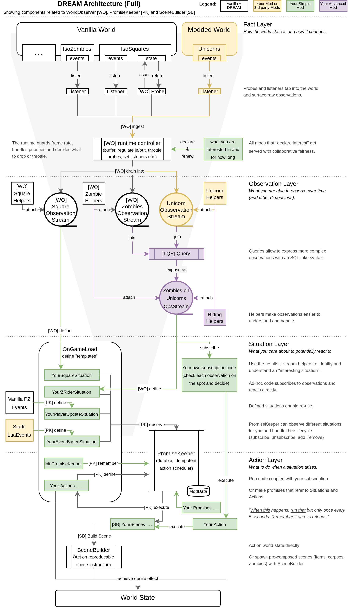

# Architecture rationale (why WorldObserver is built this way)

This page explains why WorldObserver is opinionated. The short version: modders are good at shipping features, but keep paying a tax for sensing the world—writing scan loops, taming event bursts, and stitching signals together over time.
WO tries to reduce that tax with a cooperative, budgeted observation layer and expressive builder syntax. It won’t be right for everything, but the hope is that it can make “situation logic” dramatically easier to express and maintain. "One less worry".

This page is for technically curious modders who look at WO and think: *“but why the hell…?”*
If you just want a working example first, start with [Quickstart](quickstart.md) and come back later.

## Overview

> In loop-land you write: how to scan, how often, how to avoid spam, how to correlate — over and over.  
> In stream-land you write: what you want to react to.

## The pain points WO targets

Most non-trivial mods end up building a small “world sensing engine” inside themselves:

- probe the world (or listen to events),
- throttle work so you don’t spike frame time,
- dedupe so you don’t spam your logic,
- keep small caches so you can detect changes,
- correlate multiple signals over time.

That approach works fine to a certain size and complexity but it can run into a common class of problems once you have multiple probes/listeners with different cadences and dedupe rules, or when you need to correlate signals over time (a hand‑rolled “join”)—especially during bursty moments like chunk loads/spawns and in heavily modded saves where other mods are scanning too.
In those conditions, the failure modes tend to look similar: unpredictable frame‑time spikes, noisy emissions, subtle state‑machine bugs in correlation logic, and duplicated scanning across mods. Experienced modders can manage it, but it’s still extra burden to build and maintain—work spent stemming the tide rather than improving features.

---

WorldObserver’s goal is simple:
**make world sensing a shared, bounded service** so mod code can focus on *situations* and *actions*, not on loop mechanics.

## The hard parts WO tries to handle for you

### 1) Bounded work + cooperative fairness (runtime controller + interest)

WO runs alongside other mods and shares the same frame budget.
So “it works on my machine” isn’t good enough; we want behavior that stays acceptable in the "real" world of heavily modded Zomboid.

WO tries to do that by combining:

- **opt-in by interest**: it only gathers facts when at least one mod declared interest, and
- **bounded work per tick**: probes are time-sliced/capped and ingest drain is budgeted, and
- **cooperative merging**: overlapping interest can be served by shared probes/listeners instead of N mods each scanning separately.

This combination is hard to retrofit into ad-hoc `Events.OnTick` loops because it’s a cross-cutting concern: every loop you add must agree on the same budgets, the same cadence rules, and the same priorities.

### 2) Backpressure you can reason about (ingest boundary)

In a typical mod, “world sensing” logic tends to expand inside callbacks:
you scan, you filter, you update caches, you trigger actions — often in the same tick.
That’s how you get hitching and “sometimes it freezes for 200ms”.

WO tries to enforce a boundary:

- listeners/probes emit **small records** (facts),
- those records go through **ingest buffering** and a **draining scheduler**,
- only then do observation streams deliver results to subscribers.

This turns “how much work happens per tick” into something WO can cap and report.
It also makes bursts (events firing 200 times in a frame) survivable.

Practically, this means:

- **Callbacks stay cheap; subscriptions can be heavier.** Probes/listeners should do minimal work and just ingest records. Your subscription is the right place for more consequential logic (marking, spawning, building “situations”, etc.).
- **You usually see small updates, not raw bursts.** Ingest drains incrementally and dedupes/compacts records, so you tend to receive a stream of small snapshots instead of huge chunks of work at once.
- **You don’t have to perfectly predict your own workload.** If your processing spikes occasionally, WO can usually trade freshness/cadence for stability (emit less often or later) rather than stalling the game.

### 3) “Observations, not entities” (records as snapshots)

The engine gives you live objects (`Iso*` userdata). They are powerful — and fragile:
they can become `nil`, stale, unloaded, or invalid in ways that are hard to reason about (and hard to test outside the game).

WO aims to make world sensing feel like a pervasive capability — *something always there and close to your fingertips*.
To make that feasible, observations carry **records** (snapshots) with:

- stable-ish identifiers and coordinates (the “handles” you can safely keep), and
- best-effort hydration fields (engine references when available, but never required).

That’s why a WO stream is something you can keep mounted.
Your mod logic becomes: “when I see *this situation*, do *that action*”, without holding on to engine objects as state or desperately trying to “find it again”.

## Streaming over looping (why the paradigm shift is worth it)

Even if you never touch derived streams, adopting “streams” changes how features get written.
The big win is not syntax — it’s *separating concerns*.

WO leans on a “builder” style: you compose a pipeline by chaining methods, and nothing runs until you subscribe.
That keeps world-sensing logic declarative and readable (“this stream, filtered like this, deduped like this”).

An experienced writer of SQL queries can “see the shape of the data” just from looking at the query. Well-written stream pipelines can have a similar property, while loop-and-callback code tends to mix *what* you want with *when/how* it runs, which makes the dataflow harder to see at a glance.

Here are three concise examples of what becomes simpler:

1) **Noise control becomes a first-class tool.**  
   Instead of manually tracking “did I already handle this square/zombie/vehicle recently?”, you can dedupe and filter as part of the stream contract.

2) **Time becomes explicit instead of implicit.**  
   Many “interesting situations” are fundamentally time-based: “within N seconds”, “last N events”, “for at least N seconds”.  
   Doing this with timers and ad-hoc state machines is possible, but brittle; streaming windows make the intent obvious.

3) **Correlation becomes composable.**  
   When a situation depends on multiple signals (example: “cars under attack” = vehicle context + nearby zombies + a hit/thump signal + a time window),
   the join logic is usually the hardest, buggiest part to maintain in plain loops.
   A query engine makes “what correlates with what” explicit and testable.

This is the core claim again, in practical terms:
streaming lets you write *what you care about* and lets WO handle the *how often / how bounded / how correlated* parts.

--- 

If you’ve seen any of these elsewhere, the idea is not too exotic:

- **ReactiveX** https://reactivex.io “streams of events + operators”
  
- **In The World of Javascript**
  - **RxJS** Event streams for UI, networking, input, and real-time updates
   [https://rxjs.dev/](https://rxjs.dev/)
  - **Redux** Unidirectional data flow; reducers as deterministic stream transforms
   [https://redux.js.org/](https://redux.js.org/)
  - **React** UI as a pure function of state; effects driven by state change streams
   [https://react.dev/](https://react.dev/)

- **LINQ** (C#): querying sequences with a fluent syntax
  - https://learn.microsoft.com/en-us/dotnet/csharp/programming-guide/concepts/linq/
  - And iterating on it https://github.com/Cysharp/R3 

- **In popular game engines** 
  - **Unity DOTS**: Data-oriented systems + event-style scheduling at scale
    [https://unity.com/dots](https://unity.com/dots)
  - **Unreal Gameplay Ability System:** Event-driven abilities, effects, tags, and replication
   [https://docs.unrealengine.com/5.0/en-US/gameplay-ability-system-in-unreal-engine/](https://docs.unrealengine.com/5.0/en-US/gameplay-ability-system-in-unreal-engine/)

## Why there’s a query sub-system (LQR)

LQR is a query engine for streams of records. It’s used for the situations that don’t stay simple:
joins, time windows, grouping, and rule-based emission (only emit when your condition is met).

WO uses LQR because it provides a set of unique streaming query tools in a Lua-friendly way, and because we want:

- *situations over time* to be expressible without inventing yet _another_ DSL,
- derived streams to stay **bounded** and **shareable** like base streams.

For background reading (optional):

- LQR repo: https://github.com/christophstrasen/LQR

## Interest (asking before scanning)

Interest leases (the “declare/renew” box in the diagram) are the mechanism that keeps WO honest: no interest means no probing, and declared interest gives WO enough structure to share work and keep it bounded.

They let a mod say: *what to observe* and *how fresh / how noisy* it should be (within reason), so WO can merge overlapping requests across mods and adapt under load instead of pushing that coordination work into every mod’s scan code.

## Summary & Tradeoffs

No tool can do every job in every situation, and WO is still in the early stages of maturing.

- **It’s a big abstraction.** If you’re brand new to modding, WO can hide too much too early and leavy you clueless.
- **It is asynchronous by design.** You may not get crisp timings or “every tick” guarantees, and under load WO will degrade quality to protect frame time.
- **There is overhead.** WO adds buffering, scheduling, and bookkeeping; if you need a single tight loop for one feature, rolling your own can be faster.
- **You are trusting infrastructure.** When something goes quiet, you debug a pipeline (interest → ingest → stream) rather than a single loop.

The bet is that these tradeoffs are worth it once you write features that are:
multi-signal, time-based, reliant on many different data points and fields, or shared across multiple mods — i.e. situations, not single callbacks.

## FAQ (architecture questions)

### “Why not just use `Events.OnTick`?”

Because `OnTick` gives you scheduling, not safety or cooperation.
Once you want bounded work, dedupe, correlation, and shared sensors across mods, the complexity moves from “your loop” to “your whole mod”.
WO centralizes that complexity once.

### “Why are records snapshots? I want the real engine objects.”

Because “real objects” are not a stable contract over time.
Snapshots make it possible to:

- keep streams mounted safely,
- correlate across time without holding stale userdata,
- test logic in headless Lua without the engine.

When engine objects are available, WO can attach them best-effort — but your logic shouldn’t depend on it.

### “Is this overkill for simple mods?”

Often, yes.
If your feature is one event and one action, you probably don’t need WO.
WO shines when the *second* and *third* feature show up and you start rebuilding the same sensing machinery again.

### “Will this hurt performance?”

WO’s goal is the opposite: make world sensing predictable and bounded.
But it can only do that if you treat observation as a *budgeted service*, not as “give me everything, instantly”.

If you want the next page to read, go to:

- [Quickstart](quickstart.md)
- [Observations](observations/index.md)
- [Derived streams](guides/derived_streams.md)
